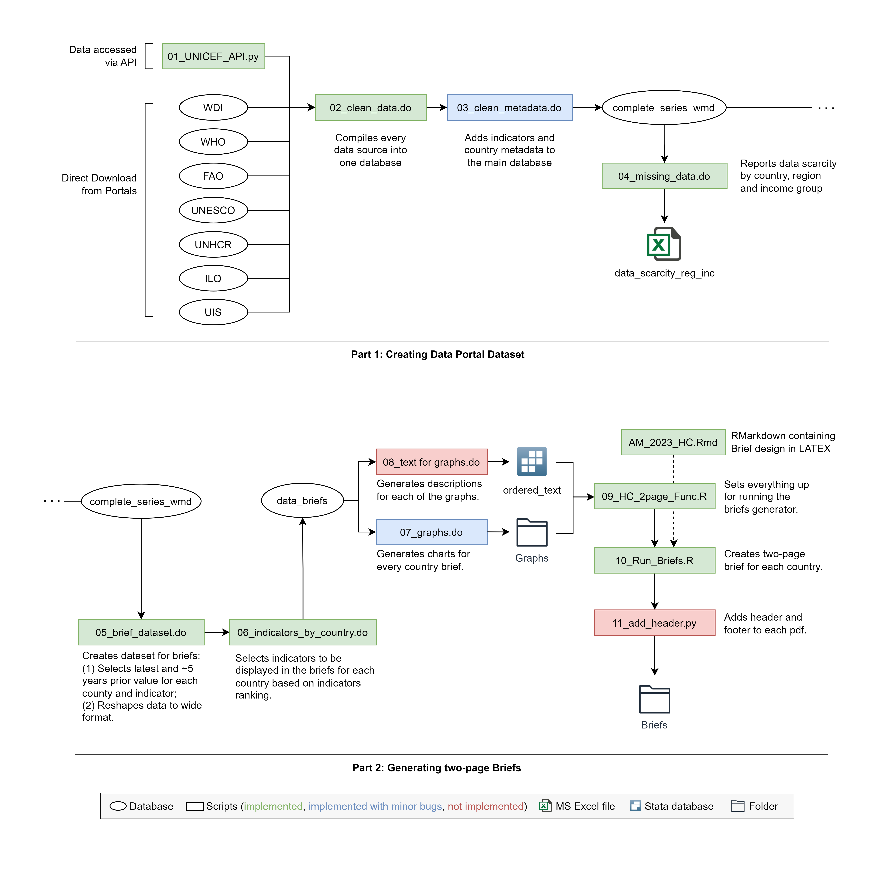

# Data Portal & Brief Generator

## Description

Unnoficial repo for the WB HCP Data Portal & Two-page Briefs. This repository contains the scripts for generating the WB HCP Data Portal dataset and generating the WB HCP Briefs (data and pdfs). Most of the data is obtained by directly downloading from the portals of relevant international organizations. However, data from UNICEF is accessed via API. 

The 'Data_Raw' directory contains the downloaded data required to run all the code. Please note that without this data, the code will not be executable.

## Getting Started

### Dependencies

* Stata 17 or higher
* Python 3.1 or higher
* Pandas  1.4.1 or higher
* [Pandasdmx 1.0](https://pandasdmx.readthedocs.io/en/v1.0/)
* R 4.3 or higher
* [R Markdown 2.22](https://rmarkdown.rstudio.com)

### Set up

Go to 00_run_all.do in root folder and check the set-up section. These options are available:

* Set the correct *path* of the repository (required)
* Change the *date* for the current version (recomended)
* Add some *extra* name for the output, useful for testing changes (optional). 

With this changes, the main outputs are: 

* The Data Portal Dataset: {path}\Data\Data_Output\complete_series_wmd_{date}_{extra}
* The two-page Briefs folder: {path}\Briefs (Note: full pipeline with R scripts not implemented yet)

### Executing program

00_run_all.do executes everything you need for creating the Data Portal Dataset and the Briefs pdfs. You can either mute the sections of Data Portal or Briefs in order to run only a subsection of the code:

* Scripts 01 to 04 creates the Data Portal Dataset (complete_series_wmd)
* Scripts 05 to 08 generates the Datasets and Charts required for creating the Briefs
* Scripts 09 to 11 creates the Briefs PDFs (not implemented yet in run_all, just run the file run_briefs.R)

## Adding Indicators to the Data Portal Database

In order to add new indicators to the Data Portal Database, it is requiered to incorporate their names and information into the metadata.xlsx file. This file serves as a centralized repository for essential details about the indicators, including their original names, Data Portal names, source information, and descriptions.

For indicators to be included also in the Briefs, it is requiered to include a rank for the indicator, and both the corresponing dimension (i.e. Education, Health or Labor) and the stage of life. 

## Summary of the code




<!-- ## Help

Any advise for common problems or issues.
```
command to run if program contains helper info
``` -->

<!-- ## Authors

Contributors names and contact info

Dominique Pizzie  
[@DomPizzie](https://twitter.com/dompizzie) -->

## Version History

* 0.1
    * Initial Release

<!-- ## License

This project is licensed under the [NAME HERE] License - see the LICENSE.md file for details -->

## Relevant links

* [World Bank Human Capital Project](https://www.worldbank.org/en/publication/human-capital)